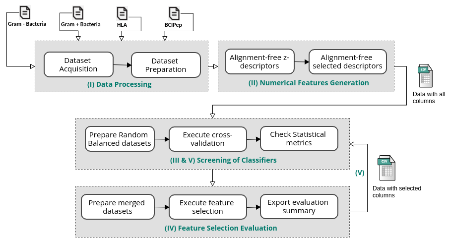

# PAPreC - Pipeline for Antigenicity Predictor Comparison

Python pipeline to prepare epitopes and protein sequence datasets, extract numerical features from sequence with alignment-free methods, perform model evaluation and test model performance upon feature selection.

## Summary

We have developed a comprehensive pipeline for comparing models used in antigenicity prediction. This pipeline encompasses a range of experiment configurations that systematically modify four key parameters: (1) the source dataset, encompassing datasets Bcipep, hla and Protegen (Yang et al. 2011); (2) the alignment-free method employed for generating numerical features; and (3) the utilization of nine distinct classifiers. 

<div style="text-align: center">
	
</div>

## Requirements:
* Python packages needed:
	- pip3 install numpy
	- pip3 install sklearn
	- pip3 install pandas
	- pip3 install matplotlib
	- pip3 install statistics
	- pip3 install boruta
	- pip3 install joblib

## Usage Instructions
### Preparation:
1. ````git clone https://github.com/YasCoMa/paprec_pipeline.git````
2. ````cd paprec_pipeline````
3. ````pip3 install -r requirements.txt````

### Run Screening:
1. ````python3 multiple_method_dataset.py````
2. Check the results obtained with those found in our article:
    - Bcipep dataset: https://www.dropbox.com/s/8ezeup4xiwb9p7n/bcipep_dataset.zip?dl=0
    - HLA dataset: https://www.dropbox.com/s/6vpfgvmsz9vd5r0/hla_dataset.zip?dl=0
    - Gram+ dataset: https://www.dropbox.com/s/l5wqpcsp4qc6ret/gram%2B_dataset.zip?dl=0
    - Gram- dataset: https://www.dropbox.com/s/cvzrhlselxj9sp5/gram-_dataset.zip?dl=0

### Run Comparison in Gram positive and negative bacteria (Optional) :
1. Download and uncompress the following folder: https://www.dropbox.com/s/27nnwhh1spl2038/gram_comparison.zip?dl=0
2. ````python3 comparison_gram.py````

## Reference

## Bug Report
Please, use the [Issues](https://github.com/YasCoMa/paprec_pipeline/issues) tab to report any bug.
